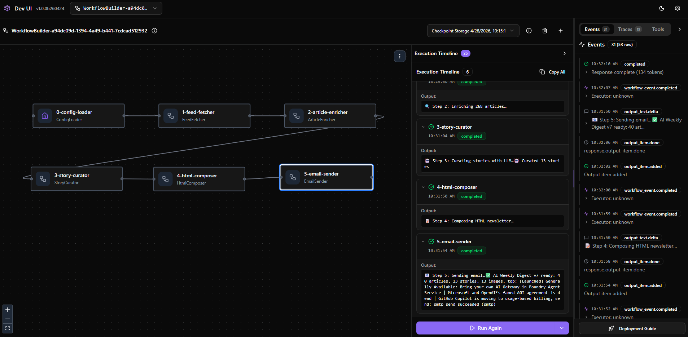

# AI Weekly Digest

**Auto-fetch 40+ RSS feeds → LLM curation & scoring → Responsive HTML newsletter → Scheduled email delivery**

[中文文档](README_CN.md)

---

## Overview

A fully automated AI newsletter pipeline that:

1. **Fetches** 40+ RSS/Atom feeds in parallel (Azure, AWS, GCP, OpenAI, Anthropic, research labs, media …)
2. **Enriches** articles with full-text extraction + OG image scraping
3. **Curates** via LLM — scores, tags, ranks, writes summaries
4. **Composes** a responsive HTML email from a template
5. **Sends** via SMTP / Azure Communication Services / SendGrid

Two ways to run:

| Mode | Entry point | Features |
|---|---|---|
| **Plain orchestrator** | `python run_pipeline.py` | Sequential 5-step pipeline, simple & debuggable |
| **Agent Framework** | `python agent_run.py` | Per-step checkpointing, streaming, resume on failure |
| **DevUI** | `python devui_run.py` | Browser-based workflow graph, event traces, checkpoint explorer |

---

## Project Structure

```
.
├── agent_run.py               # Agent Framework workflow entry point
├── agent_workflow.py           # Shared workflow definition (executors, state, graph)
├── devui_run.py               # DevUI launcher (browser-based workflow debugger)
├── run_pipeline.py            # Plain pipeline orchestrator
├── requirements.txt           # Python dependencies
├── SECURITY.md                # Security policy & reporting
│
├── config/
│   ├── config.yaml            # Main config (gitignored)
│   ├── config.example.yaml    # Template — copy to config.yaml
│   └── feeds.yaml             # 40+ RSS feed sources (9 categories)
│
├── core/                      # Core library
│   ├── models.py              # Dataclasses (Article, AppConfig, ...)
│   ├── paths.py               # Path constants & helpers
│   ├── constants.py           # Business constants (tags, patterns, ...)
│   ├── config_loader.py       # ConfigLoader
│   ├── llm_client.py          # LlmClient (OpenAI-compatible)
│   ├── feed_fetcher.py        # FeedFetcher
│   ├── article_enricher.py    # ArticleEnricher
│   ├── content_curator.py     # ContentCurator
│   ├── html_composer.py       # HtmlComposer
│   ├── email_dispatcher.py    # EmailDispatcher
│   └── utils/                 # Utility sub-package
│       ├── logging.py         #   Logging & Telegram notification
│       ├── text.py            #   HTML strip, truncate, escape
│       ├── dates.py           #   Date/time helpers & parsing
│       ├── articles.py        #   Dedup, save/load JSON
│       ├── http.py            #   HTTP request with retry
│       ├── images.py          #   Image URL validation
│       ├── modules.py         #   Lazy module loaders
│       └── cleanup.py         #   Old data file cleanup
│
├── steps/                     # Decoupled step functions
│   ├── step0_config.py        # Load & validate config
│   ├── step1_fetch.py         # Fetch RSS feeds
│   ├── step2_enrich.py        # Pre-score & enrich articles
│   ├── step3_curate.py        # LLM curation
│   ├── step4_compose.py       # Compose HTML newsletter
│   └── step5_send.py          # Send email
│
├── prompts/
│   ├── curate-v5.md           # LLM curation prompt v5
│   └── curate-v8.md           # LLM curation prompt v8 (latest scoring rubric)
├── templates/
│   ├── v7.html                # Responsive HTML email template v7
│   └── v8.html                # HTML email template v8 (latest)
│
├── image/                     # Documentation images
│   ├── workflow.png           # Workflow graph screenshot
│   └── DevUI.png              # DevUI screenshot
│
├── samples/                   # Example / demo workflows
│   ├── simple_pipeline.py     # Minimal sequential pipeline sample
│   ├── simple_checkpoint.py   # Checkpoint basics sample
│   ├── checkpoint_with_resume.py # Checkpoint with resume sample
│   ├── step1_executors_and_edges.py # Executors & edges tutorial
│   ├── step2_agents_in_a_workflow.py # Agents in a workflow tutorial
│   ├── evaluate_workflow.py   # Workflow evaluation sample
│   └── workflow_spam.py       # Spam detection workflow sample (DevUI demo)
│
├── tests/                     # Unit & integration tests
│   ├── test_config_loaded_redact.py
│   ├── test_redact.py
│   ├── test_v8_compose.py
│   └── test_versioning.py
│
├── scripts/                   # Utility scripts
│   └── secret-scan-public.sh  # Pre-push secret scanning
│
├── artifacts/                 # Intermediate data (gitignored)
│   ├── fetched-YYYY-MM-DD.json
│   ├── enriched-YYYY-MM-DD.json
│   ├── curated-YYYY-MM-DD.json
│   └── send-log.json
├── dist/                      # Final output (gitignored)
│   └── newsletter-YYYY-MM-DD.html
│
├── function/                  # Legacy modules (EmailSender used by SMTP)
│
├── .devcontainer/             # Dev Container config
│   ├── devcontainer.json      # VS Code Dev Container settings
│   └── Dockerfile             # Container image definition
│
└── .github/
    ├── CODEOWNERS             # PR review auto-assignment
    ├── dependabot.yml         # Automated dependency updates
    └── workflows/
        ├── Generate-and-Send-Daily-AI-Newsletter.yaml  # Daily newsletter pipeline
        └── ci.yml             # CI checks (lint, syntax, secret scan)
```

---

## Quick Start

### 1. Install dependencies

```bash
pip install -r requirements.txt
```

### 2. Configure

```bash
cp config/config.example.yaml config/config.yaml
```

Edit `config/config.yaml` — at minimum set:

```yaml
llm:
  api_key: "sk-..."           # or set env LLM_API_KEY / OPENAI_API_KEY
  model: "gpt-4o"

email:
  provider: "smtp"             # acs | sendgrid | smtp
  recipients:
    - "you@example.com"
  smtp_host: "smtp.example.com"
  smtp_port: 587
  smtp_user: "you@example.com"
  smtp_pass: "..."
```

### 3. Run

```bash
# Plain orchestrator
python run_pipeline.py --dry-run        # compose without sending
python run_pipeline.py                  # full run

# Agent Framework (with checkpointing)
python agent_run.py --dry-run
python agent_run.py
python agent_run.py --stream            # watch events in real time
```

---

## Running with Agent Framework

`agent_run.py` uses [Microsoft Agent Framework](https://pypi.org/project/agent-framework/) to model each pipeline step as an independent `Executor` node, connected via `WorkflowBuilder.add_edge()` into a directed workflow graph:


### Why a Multi-Executor Workflow?

A traditional script runs all steps inside a single function — if something fails halfway, you restart from scratch. By decomposing the pipeline into **6 independent executor nodes**, we get:

| Advantage | Description |
|---|---|
| **Visual Observability** | Each node appears in the [Microsoft Foundry Visualizer](https://marketplace.visualstudio.com/items?itemName=ms-windows-ai-studio.windows-ai-studio) — you can watch the execution flow in real time |
| **Fault Isolation** | If Step 3 (LLM curation) fails, Steps 0–2 results are preserved; you don't re-fetch or re-enrich |
| **Checkpointing** | The framework automatically checkpoints completed nodes — resume from the last successful step on retry |
| **Streaming Events** | Built-in `executor_invoked` / `executor_completed` events let you monitor progress without custom logging |
| **Extensibility** | Add a new step (e.g., "translate", "summarize to Slack") by adding one `Executor` class and one `.add_edge()` call |
| **Production-ready** | Swap `InMemoryCheckpointStorage` → `CosmosCheckpointStorage` for durable distributed state |

### Workflow Graph

```
ConfigLoader → FeedFetcher → ArticleEnricher → StoryCurator → HtmlComposer → EmailSender
```

Each node passes a shared `PipelineState` dataclass downstream. The Visualizer shows which node is active, completed, or failed.

### Usage

```bash
python agent_run.py                        # full pipeline run
python agent_run.py --dry-run              # skip email send
python agent_run.py --to a@x.com           # override recipients
```

### DevUI (Local Development UI)

Agent Framework ships with a built-in **DevUI** — a browser-based workflow debugger that displays the full execution graph, per-node output timeline, and event traces:



#### Launch DevUI

```bash
# Via the helper script
python devui_run.py                         # opens http://localhost:8080
python devui_run.py --port 8081             # custom port
python devui_run.py --tracing --no-open     # enable tracing, don't auto-open browser

# Or via the devui CLI directly
devui . --port 8080 --instrumentation
```

Once open, click **Run Workflow** (or **Run Again**) — DevUI will execute the full pipeline and show:

- **Workflow Graph** — 6 nodes with directed edges, highlighting active / completed / failed nodes
- **Execution Timeline** — per-node output messages and timestamps
- **Events & Traces** — 53+ raw events including `workflow_event.completed`, `output_item.added`, etc.
- **Checkpoint Storage** — automatic checkpoints for each run, resumable on failure

---

## CLI Reference

### `run_pipeline.py`

```bash
python run_pipeline.py                      # full pipeline
python run_pipeline.py --dry-run            # skip email send
python run_pipeline.py --fetch-only         # stop after fetch + enrich
python run_pipeline.py --compose-only       # re-compose from latest curated artifact
python run_pipeline.py --to a@x.com,b@y.com # override recipients
```

### `agent_run.py`

```bash
python agent_run.py                         # full pipeline with checkpointing
python agent_run.py --dry-run               # skip email send
python agent_run.py --to a@x.com            # override recipients
python agent_run.py --stream                # stream step events
```

---

## Configuring `config.yaml`

See [`config/config.example.yaml`](config/config.example.yaml) for the full schema.

### LLM

```yaml
llm:
  endpoint: "https://api.openai.com/v1/chat/completions"
  api_key: "sk-..."
  model: "gpt-4o"
```

Any OpenAI-compatible endpoint works (OpenAI, Azure OpenAI, vLLM, LiteLLM, Ollama, etc.).

### Email — pick a provider

```yaml
email:
  provider: "smtp"              # acs | sendgrid | smtp
  recipients: ["team@co.com"]

  # SMTP
  smtp_host: "smtp.office365.com"
  smtp_port: 587
  smtp_user: "you@example.com"
  smtp_pass: "..."

  # ACS (alternative)
  # acs_sender: "DoNotReply@xxx.azurecomm.net"
  # acs_connection_string: "endpoint=https://..."

  # SendGrid (alternative)
  # sendgrid_api_key: "SG.xxxx"
```

Secrets can also be set via environment variables:
`LLM_API_KEY`, `OPENAI_API_KEY`, `ACS_CONNECTION_STRING`, `SENDGRID_API_KEY`, `SMTP_HOST`, `SMTP_PORT`, `SMTP_USER`, `SMTP_PASS`, `TO_ADDRS`

---

## Customizing

| What | Where |
|---|---|
| Add / remove RSS feeds | `config/feeds.yaml` |
| Change scoring rubric / tone | `prompts/curate-v5.md` |
| Change visual layout | `templates/v7.html` |
| Change LLM model / temperature | `config/config.yaml` → `llm:` |
| Change look-back window | `config/config.yaml` → `fetch:` |

---

## GitHub Actions (Daily Automated Run)

The workflow at `.github/workflows/Generate-and-Send-Daily-AI-Newsletter.yaml` runs the pipeline daily at **UTC 08:00** and can also be triggered manually.

### Setup

1. Go to repo **Settings → Secrets and variables → Actions**
2. Add the secrets and variables listed below
3. The workflow runs `python agent_run.py` with config materialized from `NEWSLETTER_CONFIG` secret

### Required Secrets

| Secret | Description |
|---|---|
| `NEWSLETTER_CONFIG` | Full `config/config.yaml` content |
| `LLM_API_KEY` | LLM API key (overrides config) |

### Optional Variables (for env-var based config)

| Variable | Description |
|---|---|
| `SMTP_HOST` | SMTP server (e.g. `smtp.office365.com`) |
| `SMTP_PORT` | SMTP port (e.g. `587`) |
| `SMTP_USER` | Sender email |
| `SMTP_PASS` | SMTP password |
| `TO_ADDRS` | Recipients (comma-separated) |
| `FROM_ALIAS` | Sender display name |

---

## License

MIT — see [LICENSE](LICENSE).
