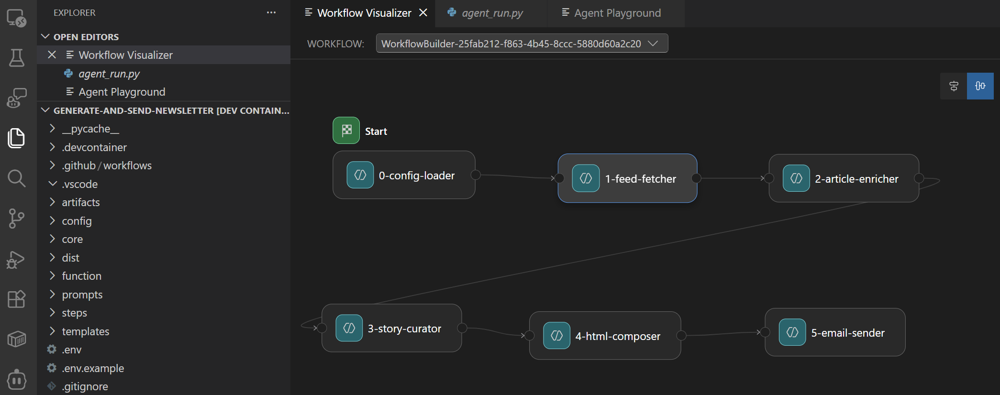

# AI Weekly Digest

**自动抓取 40+ RSS 源 → LLM 策展评分 → 生成响应式 HTML 简报 → 定时邮件发送**

[English](README.md)

---

## 简介

一个全自动的 AI 新闻简报生成与发送系统：

1. **抓取** — 并行抓取 40+ RSS/Atom 订阅源（Azure、AWS、GCP、OpenAI、Anthropic、科研实验室、媒体 …）
2. **充实** — 全文提取 + OG 图片抓取
3. **策展** — LLM 评分、打标签、排序、生成摘要
4. **组合** — 使用模板渲染响应式 HTML 邮件
5. **发送** — 支持 SMTP / Azure Communication Services / SendGrid

两种运行方式：

| 模式 | 入口 | 特点 |
|---|---|---|
| **普通编排器** | `python run_pipeline.py` | 顺序执行 5 步，简单直观，便于调试 |
| **Agent Framework** | `python agent_run.py` | 逐步检查点、流式输出、失败后断点续跑 |

---

## 项目结构

```
.
├── agent_run.py               # Agent Framework 工作流入口
├── run_pipeline.py            # 普通流水线编排器
├── requirements.txt
│
├── config/
│   ├── config.yaml            # 主配置（已 gitignore）
│   ├── config.example.yaml    # 模板 — 复制为 config.yaml
│   └── feeds.yaml             # 40+ RSS 订阅源（9 个分类）
│
├── core/                      # 核心库
│   ├── models.py              # 数据类（Article, AppConfig, ...）
│   ├── paths.py               # 路径常量与工具
│   ├── constants.py           # 业务常量（标签、正则等）
│   ├── config_loader.py       # 配置加载器
│   ├── llm_client.py          # LLM 客户端（兼容 OpenAI）
│   ├── feed_fetcher.py        # RSS 抓取器
│   ├── article_enricher.py    # 文章充实器
│   ├── content_curator.py     # 内容策展器
│   ├── html_composer.py       # HTML 组合器
│   ├── email_dispatcher.py    # 邮件发送器
│   └── utils/                 # 工具子包
│       ├── logging.py         #   日志 & Telegram 通知
│       ├── text.py            #   HTML 清理、截断、转义
│       ├── dates.py           #   日期时间工具
│       ├── articles.py        #   去重、JSON 持久化
│       ├── http.py            #   带重试的 HTTP 请求
│       ├── images.py          #   图片 URL 校验
│       ├── modules.py         #   模块懒加载
│       └── cleanup.py         #   旧数据清理
│
├── steps/                     # 解耦的步骤函数
│   ├── step0_config.py        # 加载配置
│   ├── step1_fetch.py         # 抓取 RSS
│   ├── step2_enrich.py        # 预评分与充实
│   ├── step3_curate.py        # LLM 策展
│   ├── step4_compose.py       # 组合 HTML
│   └── step5_send.py          # 发送邮件
│
├── prompts/
│   └── curate-v5.md           # LLM 策展提示词（评分标准）
├── templates/
│   └── v7.html                # 响应式 HTML 邮件模板
│
├── artifacts/                 # 中间产物（已 gitignore）
├── dist/                      # 最终输出（已 gitignore）
├── function/                  # 遗留模块（SMTP 发送仍在使用）
└── .github/workflows/
    └── Generate-and-Send-Daily-AI-Newsletter.yaml
```

---

## 快速开始

### 1. 安装依赖

```bash
pip install -r requirements.txt
```

### 2. 配置

```bash
cp config/config.example.yaml config/config.yaml
```

编辑 `config/config.yaml`，至少设置：

```yaml
llm:
  api_key: "sk-..."           # 或设置环境变量 LLM_API_KEY / OPENAI_API_KEY
  model: "gpt-4o"

email:
  provider: "smtp"             # acs | sendgrid | smtp
  recipients:
    - "you@example.com"
  smtp_host: "smtp.example.com"
  smtp_port: 587
  smtp_user: "you@example.com"
  smtp_pass: "..."
```

### 3. 运行

```bash
# 普通编排器
python run_pipeline.py --dry-run        # 只生成不发送
python run_pipeline.py                  # 完整运行

# Agent Framework（带检查点）
python agent_run.py --dry-run
python agent_run.py
python agent_run.py --stream            # 实时查看事件
```

---

## 使用 Agent Framework 运行

`agent_run.py` 基于 [Microsoft Agent Framework](https://pypi.org/project/agent-framework/)，将每个步骤建模为独立的 `Executor` 节点，通过 `WorkflowBuilder.add_edge()` 连接成有向工作流图：



### 为什么使用多 Executor 工作流？

传统脚本将所有步骤放在一个函数里 — 中途失败就要从头重跑。将流水线拆分为 **6 个独立 Executor 节点** 后，获得以下优势：

| 优势 | 说明 |
|---|---|
| **可视化观测** | 每个节点在 [Microsoft Foundry Visualizer](https://marketplace.visualstudio.com/items?itemName=ms-windows-ai-studio.windows-ai-studio) 中独立显示，可实时观察执行流程 |
| **故障隔离** | 如果步骤3（LLM策展）失败，步骤0-2的结果已保留，无需重新抓取和充实 |
| **自动检查点** | 框架自动对已完成节点做检查点 — 重试时从最后成功的步骤恢复 |
| **流式事件** | 内置 `executor_invoked` / `executor_completed` 事件，无需自定义日志即可监控进度 |
| **易于扩展** | 新增步骤（如"翻译"、"推送到 Slack"）只需添加一个 `Executor` 类和一行 `.add_edge()` |
| **生产就绪** | 将 `InMemoryCheckpointStorage` 替换为 `CosmosCheckpointStorage` 即可实现持久化分布式状态 |

### 工作流图

```
ConfigLoader → FeedFetcher → ArticleEnricher → StoryCurator → HtmlComposer → EmailSender
（加载配置）   （抓取RSS）    （文章充实）      （LLM策展）     （组合HTML）    （发送邮件）
```

每个节点通过共享的 `PipelineState` 数据类向下游传递状态。Visualizer 实时显示哪个节点正在执行、已完成或失败。

### 使用方式

```bash
# HTTP 服务器模式（用于 Agent Inspector / Visualizer）
python agent_run.py

# CLI 模式
python agent_run.py --cli --dry-run        # 跳过邮件发送
python agent_run.py --cli                  # 完整运行
python agent_run.py --cli --to a@x.com     # 覆盖收件人
```

### Visualizer 配置步骤

1. 安装 [Microsoft Foundry for VS Code](https://marketplace.visualstudio.com/items?itemName=ms-windows-ai-studio.windows-ai-studio) 扩展
2. 打开命令面板（`Ctrl+Shift+P`）→ 执行 `Microsoft Foundry: Open Visualizer for Hosted Agents`
3. 运行 agent — 工作流图会实时更新

---

## 命令行参考

### `run_pipeline.py`

```bash
python run_pipeline.py                      # 完整流水线
python run_pipeline.py --dry-run            # 跳过发送
python run_pipeline.py --fetch-only         # 仅抓取 + 充实
python run_pipeline.py --compose-only       # 从最新产物重新组合
python run_pipeline.py --to a@x.com,b@y.com # 覆盖收件人
```

### `agent_run.py`

```bash
python agent_run.py                         # 完整流水线（带检查点）
python agent_run.py --dry-run               # 跳过发送
python agent_run.py --to a@x.com            # 覆盖收件人
python agent_run.py --stream                # 流式输出事件
```

---

## 配置说明

详见 [`config/config.example.yaml`](config/config.example.yaml)。

### LLM

```yaml
llm:
  endpoint: "https://api.openai.com/v1/chat/completions"
  api_key: "sk-..."
  model: "gpt-4o"
```

支持任意 OpenAI 兼容端点（OpenAI、Azure OpenAI、vLLM、LiteLLM、Ollama 等）。

### 邮件 — 选择提供商

```yaml
email:
  provider: "smtp"              # acs | sendgrid | smtp
  recipients: ["team@co.com"]

  # SMTP
  smtp_host: "smtp.office365.com"
  smtp_port: 587
  smtp_user: "you@example.com"
  smtp_pass: "..."

  # ACS（替代方案）
  # acs_sender: "DoNotReply@xxx.azurecomm.net"
  # acs_connection_string: "endpoint=https://..."

  # SendGrid（替代方案）
  # sendgrid_api_key: "SG.xxxx"
```

敏感信息也可通过环境变量设置：
`LLM_API_KEY`、`OPENAI_API_KEY`、`ACS_CONNECTION_STRING`、`SENDGRID_API_KEY`、`SMTP_HOST`、`SMTP_PORT`、`SMTP_USER`、`SMTP_PASS`、`TO_ADDRS`

---

## 自定义

| 想改什么 | 在哪里改 |
|---|---|
| 增删 RSS 源 | `config/feeds.yaml` |
| 修改评分标准 / 文风 | `prompts/curate-v5.md` |
| 修改邮件样式 | `templates/v7.html` |
| 修改 LLM 模型 / 参数 | `config/config.yaml` → `llm:` |
| 修改回溯天数 | `config/config.yaml` → `fetch:` |

---

## GitHub Actions（每日自动运行）

工作流 `.github/workflows/Generate-and-Send-Daily-AI-Newsletter.yaml` 每天 **UTC 08:00** 自动运行，也支持手动触发。

### 配置方法

1. 进入仓库 **Settings → Secrets and variables → Actions**
2. 添加下列 Secrets 和 Variables
3. 工作流会从 `NEWSLETTER_CONFIG` Secret 生成配置文件，然后执行 `python agent_run.py`

### 必需的 Secrets

| Secret | 说明 |
|---|---|
| `NEWSLETTER_CONFIG` | 完整的 `config/config.yaml` 内容 |
| `LLM_API_KEY` | LLM API 密钥（覆盖配置文件中的值） |

### 可选的 Variables（通过环境变量配置）

| Variable | 说明 |
|---|---|
| `SMTP_HOST` | SMTP 服务器（如 `smtp.office365.com`） |
| `SMTP_PORT` | SMTP 端口（如 `587`） |
| `SMTP_USER` | 发件人邮箱 |
| `SMTP_PASS` | SMTP 密码 |
| `TO_ADDRS` | 收件人（逗号分隔） |
| `FROM_ALIAS` | 发件人显示名称 |

---

## 许可证

MIT — 详见 [LICENSE](LICENSE)。
